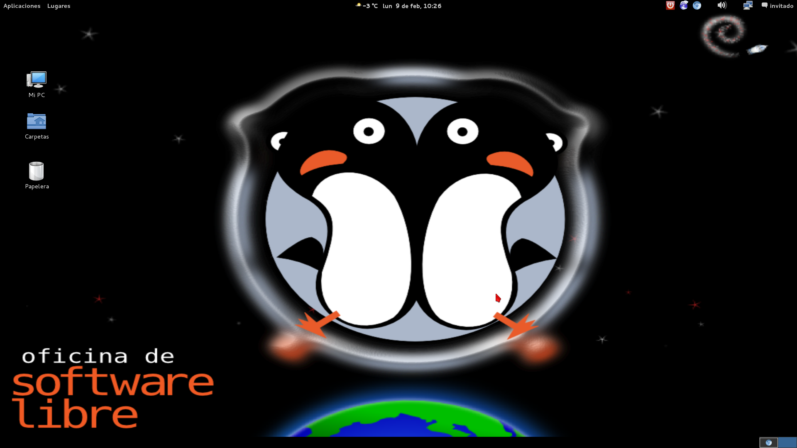
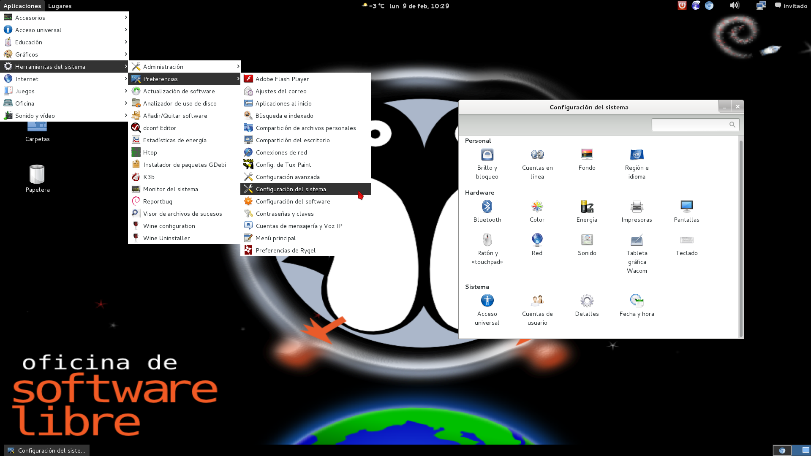
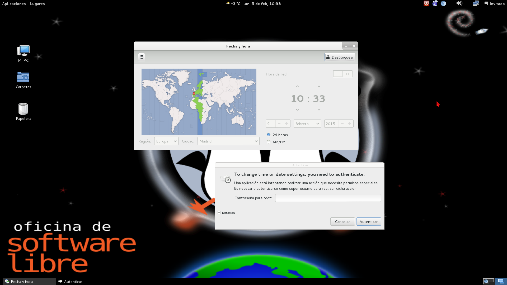
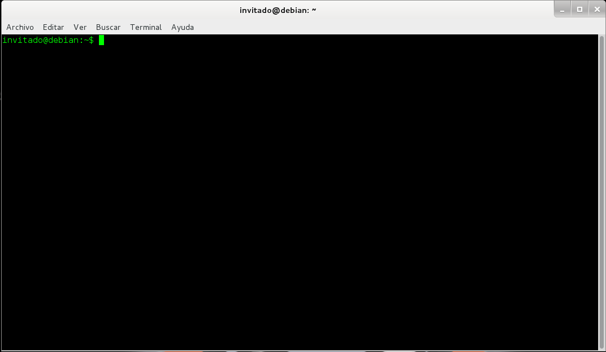
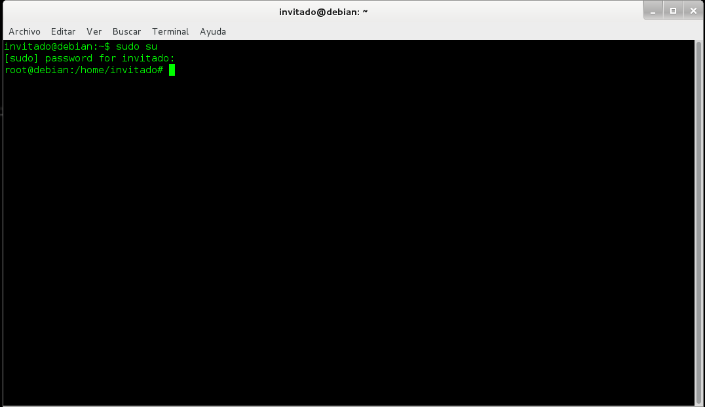
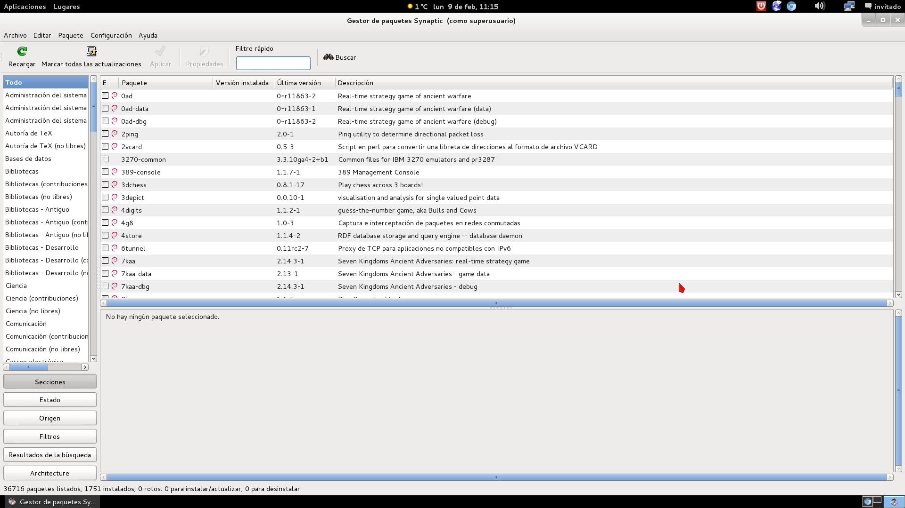

Manual de usuario Gnome

 

Esta obra está bajo una [licencia Creative Commons
Atribución-NoComercial-CompartirIgual 3.0
España](http://www.google.com/url?q=http%3A%2F%2Fcreativecommons.org%2Flicenses%2Fby-nc-sa%2F3.0%2Fes%2Fdeed.es&sa=D&sntz=1&usg=AFQjCNGkV9MBtb0OhEgQ3wuBPorWwgveUg).

Índice 
===================

[Índice](#h.bdiddubucis6)

[Iniciar el equipo](#h.xme1zer1a2q6)

[Cuenta de usuario](#h.wf1lz8cw0slt)

[Poner en hora el equipo](#h.1m8wxir7z11b)

[Programas básicos
instalados](#h.5sjshs2an5fp)

[IceWeasel](#h.c62wsg6iawpm)

[LibreOffice](#h.rgfipxe4kf4i)

[Gedit](#h.hhre60hyfnle)

[Gimp](#h.s6u54z2ks9ea)

[Vlc](#h.udr5ube9mle)

[Tux Paint](#h.b0nqkzlv4ni6)

[Administración del sistema](#h.p9vfao72ffa0)

[Sistema de archivos](#h.kjxe44r3z6n9)

[Cuenta de superusuario](#h.j2yobd3gkeft)

[Consola (Terminal)](#h.yt9wt3ysp1sh)

[Instalar programas](#h.52h8i9kqxom1)

[Desde gestor de paquetes
Synaptic](#h.fh7b8tqgdov7)

[Administración avanzada](#h.35cxd3xid94p)

[Otras formas de instalar
programas](#h.8tr3k0e184t9)

[Descargando el paquete desde la página web de la
aplicación](#h.kth6rpdumw3o)

[Desde consola](#h.l2vtn0ozihpt)

[Sistema de archivos](#h.xdrvc65yvcba)

[Contacto](#h.p3vbmqdui30j)

## Iniciar el equipo

Al arrancar el equipo deberá de aparecer una imagen de
la Oficina de Software Libre con dos opciones de arranque.

Para iniciar el sistema de forma normal seleccionamos la primera opción de las dos posibles.

Esta primera opción se seleccionará automáticamente al
cabo de unos segundos si no pulsamos ninguna tecla.

En caso de que no aparezca la imagen indicada,
es posible que sea necesario pulsar la tecla F1. Deberemos de leer lo
que se muestre por pantalla y seguir las instrucciones. Si no consigue
arrancar el equipo, póngase en contacto con nosotros indicando el
problema y el texto mostrado por pantalla (si toman una fotografía se lo
agradeceríamos para solventar el problema).

El escritorio será algo parecido a la siguiente
imagen donde indicamos los elementos principales:

Un [sistema
operativo](http://www.google.com/url?q=http%3A%2F%2Fes.wikipedia.org%2Fwiki%2FSistema_operativo&sa=D&sntz=1&usg=AFQjCNEtWOudBBPRFaT4xqu2XpKDl5ZiGA) es el conjunto de programas básicos y utilidades que hacen
que funcione su equipo. El sistema operativo instalado es un
[Debian](http://www.google.com/url?q=http%3A%2F%2Fwww.debian.org%2Findex.es.html&sa=D&sntz=1&usg=AFQjCNFxyDgMl_RUu6sQA8mKEIB8WHSqxQ) que es una versión de Linux. Este sistema operativo es
similar a los más conocidos Guadalinex o Ubuntu. 

Un [entorno de
escritorio](http://www.google.com/url?q=http%3A%2F%2Fes.wikipedia.org%2Fwiki%2FEntorno_de_escritorio&sa=D&sntz=1&usg=AFQjCNEzRLR3xF1FJHmrrk-Ze18wpD3_mQ) por lo general consiste de iconos, ventanas, barras de
herramientas, carpetas, fondos de pantalla y widgets de escritorio. El
entorno instalado es [Gnome](http://www.google.com/url?q=http%3A%2F%2Fwww.gnome.org%2F&sa=D&sntz=1&usg=AFQjCNHR4PoBOzRK6zRV6hmyrnxy4809Uw), un entorno ligero que tiene como objetivo ser rápido y de
bajos recursos del sistema, sin dejar de ser visualmente atractivo y
fácil de usar.

* Cuenta de usuario
* 
Posteriormente, nos aparece una pantalla de fondo azul que nos pide un usuario y contraseña. Introducimos los
siguientes datos:

* Usuario:******
* Contraseña:******

Es posible que el sistema tarde cierto tiempo en cargarse completamente.

## Poner en hora el equipo

Si la hora indicada en la derecha del panel inferior no
es correcta deberá seguir los siguientes pasos para cambiarla.

Diríjase a:

>+ Aplicaciones / Herramientas del sistema /
>* Preferencias / Configuración del sistema /

Tal y como se muestra en la siguiente imagen:

Aparecerá una ventana en la que no se nos permitirá
modificar nada. Para poder cambiar los valores tenemos que pulsar sobre
el escudo que se muestra en la parte inferior de esta ventana. Pedirá
una contraseña. En este caso hay que introducir la contraseña de
superusuario (explicado en el apartado Administración del sistema /
Cuenta de superusuario):

* Contraseña:*******                        |

Ahora podemos poner la hora y la fecha
actuales. Si vuelve a pedir una contraseña se debe de introducir la de
superusuario, indicada en el recuadro anterior.

## Programas básicos instalados

El equipo tiene instalados por defecto diversas
aplicaciones libres que abarcan distintas necesidades a la hora de
trabajar o de utilizar el ordenador. A continuación puede conocer mejor
alguno de los más básicos y útiles.>

## IceWeasel 

Iceweasel es uno de los navegadores que viene con el equipo, su funcionalidad
prácticamente idéntica a la del gran navegador Firefox, ya que con este
navegador podremos acceder a internet además de poder abrir incluso
ficheros de texto y más.

Para usar la aplicación diríjase a:

>+ Aplicaciones / Internet / Iceweasel

Para más información, diríjase al folleto formativo
nº 3
proporcionado.

## LibreOffice

Esta suite ofimática incluye una serie de aplicaciones tales como Writer, Impress, Draw, Calc y Base. 
Estas aplicaciones le permitirán trabajar con textos, presentaciones y hojas de cálculos entre otras.

Para usar la aplicación diríjase a:

>+ Aplicaciones / Oficina / LibreOffice Writer

Seleccione en este último lugar la aplicación que desee según quiera trabajar con textos (Writer), hojas de cálculo (Calc),presentaciones (Impress), dibujos (Draw) o bases de datos. Para más información, diríjase
a los folletos formativos nº 5, 6, 7 proporcionados.

## Gedit

Gedit es una aplicación que sirve para editar ficheros de texto plano. 
Con Gedit podemos crear desde simples documentos de texto sin ningún tipo de
formato, redactar o tomar notas respecto de algo hasta poder editar
archivos de páginas web o archivos pertenecientes a un programa.

Para usar la aplicación diríjase a:

>+ Aplicaciones / Accesorios / Gedit                               |

## Gimp 

Gimp es un programa de dibujo a mano alzada y retoque fotográfico, libre, gratuito y similar al privativo Photoshop. Te permite trabajar con capas, rutas, canales, tiene muchas utilidades y
herramientas: seleccionar áreas por geometría, color (varita mágica),
forma (tijeras), capturar colorear, ampliar, reducir, rotar, deformar,medir distancias, mover, alinear, recortar, inclinar, perspectiva,volteo, texto personalizado, rellenar pintado, mezcla, degradados,
mosaicos, pinceles, lápiz, rotulador, aerografo, goma, escritura estilo caligrafía (tinta), dibujo a mano alzada, clonado, saneado, enfoque,desenfoque, emborronar, quemar...

También incluye muchos filtros y efectos para aplicar a los dibujos. Como quitar ojos rojos en las fotografías, distorsiones,sombras, detectar bordes... Lee muchísimos formatos de archivos, entre ellos psd de Photoshop, y puede guardar tus creaciones en xcf (formato predefinido), png, jpg, gif, ico, bmp, y muchos otros.

Para usar la aplicación diríjase a:

>+ Aplicaciones / Gráficos / Programa de manipulación imágenes GNU

Para más información, diríjase al folleto formativo nº 4 proporcionado.

## Vlc

Vlc es un programa para reproducir tanto música o vídeos en una gran cantidad de formatos distintos (mp3, avi, mkv, mp4,ogv, etc). También permite incorporar subtítulos con formato srt a un vídeo arrastrando directamente el archivo de subtítulos a la imagen del vídeo en reproducción.

Para usar la aplicación diríjase a:

>+ Aplicaciones / Sonido y vídeo / Reproductor multimedia VLC

Una vez abierto el programa, puede reproducir música o vídeo desde:

>+ Medio / Abrir archivo                         |

Y seleccionar el archivo deseado. También puede crear una lista de reproducción con todos los archivos reproducibles de un directorio indicando Abrir directorio y seleccionando el directorio que contiene estos archivos.

Otra posibilidad, es usar la aplicación directamente desde el archivo de vídeo o audio. Si este archivo tiene el icono correspondiente a Vlc, bastará con un doble click, en caso contrario,será necesario pulsar con el botón derecho del ratón y seleccionar Abrir con / Reproductor multimedia Vlc.

 

## Paint

Esta herramienta permite realizar dibujos de forma sencilla y rápida, recortar  o modificar imágenes y otras utilidades normales de un programa de dibujo libre. Normalmente es utilizado por niños y niñas ya que la interfaz es muy intuitiva y permite la creación de dibujos de forma divertida.

Para usar la aplicación diríjase a:

>+ Aplicaciones / Educación / Tux Paint

De nuevo, tenemos la posibilidad de arrancar el programa a partir de una imagen que tengamos guardada. Para ello
pinchamos con el botón derecho del ratón sobre la imagen que queremos abrir y seleccionamos Abrir con / Tux Paint.

## Consola (Terminal)

La terminal es una de las aplicaciones que tiene Linux con más potencia ya que a partir de esta podemos manejar
todo el sistema, como por ejemplo ejecutar programas, instalarlos,editar archivos o incluso reiniciar o apagar el equipo.

Bien para ejecutar la terminal (o consola) nos dirigimos a:

>+ Aplicaciones / Accesorios / Terminal

O en la barra del menú del escritorio encontraremos el icono que hace referencia a la terminal. Esta
representa una interfaz parecida a la siguiente:

Aparte de esta terminal, existen otras terminales (se les llaman terminales virtuales) que son iguales que esta
que podemos ver pero la diferencia que es sólo se trabaja en modo texto en esas terminales sin ningún gráfico. Para hacer uso de ellas tendremos que ejecutar la combinación de teclas: Ctrl+Alt+F1 donde el F1 lo podemos sustituir por las
siguientes teclas F2 en adelante hasta F6. Para volver al modo gráfico haremos uso de la combinación:
Ctrl+Alt+F7.

        [Aquí](http://www.google.com/url?q=http%3A%2F%2Fwww.inkilino.com%2Farchivos%2FComandos-Unix.pdf&sa=D&sntz=1&usg=AFQjCNEpaTUACzhT4GKtKU62eleAZYQHbQ) tiene un listado de comandos para poder usar la terminal,
pero explicaremos los comandos más básicos y usuales.

-   cd Nos sirve para
    movernos a través de las carpetas.

<!-- -->

-   cp /home/invitado/Descargas

<!-- -->

-   ls Se usa para hacer un
    listado del contenido de una carpeta.

<!-- -->

-   ls /home/invitado/Imágenes

<!-- -->

-   cat Este comando es útil
    para mostrar por pantalla el contenido de un fichero de texto, se
    suele usar junto con otros comandos más avanzados.

<!-- -->

-   cat /home/invitado/Documentos/Leeme.txt

<!-- -->

-   cp Sirve para hacer
    duplicar ficheros.

<!-- -->

-   cp Leeme.txt Leeme.txt.copia

<!-- -->

-   mv Con este podemos
    cambiarle el nombre a un fichero.

<!-- -->

-   mv Equipos.txt Ordenadores.txt

<!-- -->

-   rm Si queremos borrar un
    fichero este es nuestro comando.

<!-- -->

-   rm Leeme.txt

<!-- -->

-   date Nos muestra la
    fecha y hora del sistema.

<!-- -->

-   date

<!-- -->

-   cal Dibuja en la
    terminal un calendario del mes actual.

<!-- -->

-   cal

<!-- -->

-   exit Bien nos sirve para
    cerrar la terminal o para cerrar la sesión del superusuario.

<!-- -->

-   exit

        Incluso tenemos atajos en la terminal y más
cosas al respecto pero eso ya se escapa de este manual.

 

Administración del sistema 
=======================================

### Sistema de archivos 

        Los documentos personales se guardan por
defecto en una carpeta llamada home. Se puede acceder a esta
carpeta desde:

+--------------------------------------------------------------------------+
| Lugares / Carpetas                                            |
+--------------------------------------------------------------------------+

        Dentro del sistema de carpetas nos podemos
mover entrando a ellas de la misma forma que con el resto de sistemas
operativos tanto Linux como Windows.

En la siguiente imagen se puede ver de forma gráfica lo
explicado:

Como vemos la información se representa como si fuera
un árbol invertido, donde la raíz del árbol es del directorio indicado
por / y a su vez
cuelgan más directorios indicados por los recuadros y los ficheros que
podemos acceder .

Por ejemplo si accedemos a una foto llamada “osl.png”
perteneciente al usuario “serafin” el sistema operativo pasaría por la
ruta de acceso:

+--------------------------------------------------------------------------+
| /home/serafin/Fotos/osl.png                   |
+--------------------------------------------------------------------------+

Bien pues la carpeta personal del usuario “invitado” se
encuentra en la ruta:

+--------------------------------------------------------------------------+
| /home/invitado/                               |
+--------------------------------------------------------------------------+

###  {.c15 .c16 .c36}

### Cuenta de superusuario {.c15 .c16}

        Los sistemas Linux como el que ha sido
instalado en el ordenador que tenga tienen distintos roles de usuario,
al igual que en una empresa que se encuentra el director, los
subdirectores y nos encontraríamos por ejemplo ya los empleados, cada
uno de ellos con diferentes privilegios para hacer o deshacer cosas, en
Linux existe lo que se llama el superusuario (sería como el director de
la empresa), que es el usuario que tiene todos los privilegios para
administrar y manejar el sistema a diferencia de un usuario normal (como
el usuario invitado) que tiene acceso limitado a una serie de
aplicaciones y de opciones de administración. 

+--------------------------------------------------------------------------+
| Usuario: root                                 |
|                                                                          |
| Contraseña: osloslugr                         |
+--------------------------------------------------------------------------+

Para hacer uso de la cuenta de superusuario, tenemos
que abrir una terminal y en ella escribir la palabra su y como contraseña la indicada
en el recuadro anterior, quedando como en la imagen:

        Una vez estemos como superusuario podremos
hacer todo lo que queramos, desde poder modificar ficheros tales como el
que almacena la información de los repositorios, instalar aplicaciones o
incluso modificar el menú de Grub para el arranque del sistema.

Al terminar de hacer las tareas que quisiéramos debemos
finalizar la sesión para evitar que ningún usuario malintencionado haga
mal uso del equipo, para ello escribiremos el comando:

+--------------------------------------------------------------------------+
| exit                                          |
+--------------------------------------------------------------------------+

 {.c15 .c23 .c16}

Instalar programas {.c15 .c16}
------------------------------------------

        Cuando queremos instalar algún programa nuevo
podemos hacerlo de muchas formas. A continuación vamos a explicar las
tres más fáciles. Para todas ellas será necesario introducir la
contraseña de superusuario ya que la instalación de programas es una
tarea de administración que únicamente se puede hacer si se tienen
privilegios de administrador.

Recordamos que la contraseña que hay que introducir
es:

+--------------------------------------------------------------------------+
| Contraseña: ******                                          |
+--------------------------------------------------------------------------+

### Desde gestor de paquetes Synaptic {.c15 .c16}

        Esta aplicación, es una de las más usadas para
instalar aplicaciones y es la que de hecho se recomienda para esta
tarea. Nos iremos a:

+--------------------------------------------------------------------------+
| Aplicaciones / Herramientas del sistema /           |
| Administración / Gestor de paquetes Synaptic                      |
+--------------------------------------------------------------------------+

En el panel izquierdo disponemos de las categorías de
los programas para instalar, así que si seleccionamos una de ellas, se
nos reflejará en el panel derecho el listado de aplicaciones
relacionadas con esa categoría.

Para instalar una aplicación concreta, debemos tener
seleccionada la opción de Todo y en el recuadro de búsqueda escribiremos el nombre de la
aplicación a instalar, por ejemplo Inkscape
y conforme vayamos escribiendo el nombre del
programa se irá actualizando el listado de programas que concuerdan con
lo que tiene el recuadro de búsqueda. Una vez tengamos en el listado la
aplicación que queremos, hacemos doble click en la entrada del programa
para marcarlo para instalar, ya que podemos seleccionar varios programas
para instalarlos todos.

Un programa a instalar es lógico que necesite de otros
programas o librerías para que se pueda instalar así que si al querer
instalar una aplicación esta requiere algo que no tengamos instalado,
nos aparecerá una imagen indicando esta situación, así que haremos click
en el botón de aceptar para indicar que esos programas también se tienen
que instalar.

Por último para proceder a la instalación pincharemos
en el botón de Aplicar confirmando los cambios que se van a hacer en el sistema y
esperamos a que se termine de instalar lo que estuviera elegido.

Nos pedirá la contraseña de superusuario, así que se la
proporcionamos y se nos ejecutará la aplicación, teniendo una interfaz
parecida a la siguiente:

###  {.c15 .c36}

Administración avanzada {.c15}
====================================

Otras formas de instalar programas {.c15}
----------------------------------------------------------

### Descargando el paquete desde la página web de la aplicación {.c3}

        Los paquetes son archivos acabados en
.deb que al ejecutarlos instalan en nuestro ordenador el programa
de forma automática. Muchas aplicaciones tienen en su web oficial un
enlace de descarga del archivo .deb. 

Para iniciar basta con hacer doble click sobre el
archivo descargado y pulsar posteriormente el botón de instalar
el paquete que hay en la
ventana que aparece. Al ejecutar el paquete (el archivo .deb) nos pedirá la contraseña
antes mencionada.

### Desde consola {.c3}

        Hay una forma muy sencilla de instalar un
programa y es utilizando la consola que se ha explicado antes.

En primer lugar debemos de identificarnos como
superusuario escribiendo en consola:

+--------------------------------------------------------------------------+
| su                                            |
+--------------------------------------------------------------------------+

A continuación nos pide una contraseña y debemos
escribir la contraseña de superusuario.

+--------------------------------------------------------------------------+
| ******                                     |
+--------------------------------------------------------------------------+

Para hacer uso de esta forma para instalar programas
debemos usar dos órdenes, una para buscar el programa en cuestión y
luego otra orden para instalar la aplicación.

        Como acabamos de decir lo primero es buscar el
programa, para ello en la terminal escribiremos el comando:

+--------------------------------------------------------------------------+
| apt-cache search \<patrón de búsqueda\>       |
+--------------------------------------------------------------------------+

        Con patrón de búsqueda se indica que podemos
poner una cadena de texto y buscar todas las aplicaciones que tienen en
su nombre esa coincidencia, por ejemplo si queremos buscar el navegador
web Chromium escribiremos:

+--------------------------------------------------------------------------+
| apt-cache search chromium                     |
+--------------------------------------------------------------------------+

        Con ellos nos aparecerá un listado de
aplicaciones que coinciden con ese nombre, entre ellas estará el
navegador.

Luego la orden que instala un programa es apt-get install y la podemos usar
de la siguiente forma:

                

+--------------------------------------------------------------------------+
| apt-get install \<nombre de la aplicación\>   |
+--------------------------------------------------------------------------+

        Donde \<nombre de
la aplicación\> es el nombre de la aplicación o
programa a instalar. Por ejemplo:

+--------------------------------------------------------------------------+
| apt-get install chromium-browser             |
+--------------------------------------------------------------------------+

        Sin embargo, es
posible que no encuentre el programa indicado. Es debido a que el
sistema necesita saber dónde puede encontrar ese programa para
instalarlo y no siempre se sabe dónde se encuentra. En estos casos hay
que añadir “la dirección al lugar” desde el cual el sistema puede
descargar e instalar el programa. Estos “lugares” se llaman repositorios
y el sistema tiene por defecto algunos desde los que tiene acceso a un
gran número de programas y aplicaciones conocidas.

        Para que nos resulte más fácil indicar el
programa con la orden apt-get
install podemos, al comenzar a escribir al final
de la orden el nombre del programa, darle a la tecla de tabulación. Esta
tecla hará que el ordenador intente completar la palabra con todos los
programas que empiezan de esa forma y que conoce en sus repositorios. Un
ejemplo:

        Si queremos instalar el navegador Chromium
escribimos:

+--------------------------------------------------------------------------+
| apt-get install chr                          |
+--------------------------------------------------------------------------+

        Y pulsamos tabulador, en consola se mostrarán
aplicaciones que comienzan por chr y entre ellas la que estamos
buscando, permitiéndonos completar el nombre del programa.

 {.c15 .c23}

Sistema de archivos {.c15}
-------------------------------------------

Todo sistema operativo tiene lo
que se llama el sistema de archivos (o sistema de ficheros), esta parte
del sistema operativo estructura la información guardada en una unidad
de almacenamiento (normalmente un disco duro de una computadora), que
luego será representada ya sea textual o gráficamente utilizando
un[gestor de
archivos](http://www.google.com/url?q=http%3A%2F%2Fes.wikipedia.org%2Fwiki%2FGestor_de_archivos&sa=D&sntz=1&usg=AFQjCNEt2g5AqQxcd4hSpRxWTx9d8NnD4A). La mayoría de los[sistemas
operativos](http://www.google.com/url?q=http%3A%2F%2Fes.wikipedia.org%2Fwiki%2FSistemas_operativos&sa=D&sntz=1&usg=AFQjCNGUhZjf__vRbzy69RmQwiuHwVqRGA) manejan su propio sistema de archivos

Existen diversos tipos tales como ext2, ext3 que son los tipos nativos de
Linux o FAT, NTFS de Windows. Linux tiene su forma de estructurar la
información, para ello usa un sistema de archivos ramificado para
organizar la información y acceder a los datos, es decir, usamos un
árbol para localizar los ficheros, haciendo una analogía digamos que es
parecido a si nos subiéramos a un árbol y nos moviéramos por las ramas
hasta llegar a las hojas.

La carpeta del administrador se encuentra en:

+--------------------------------------------------------------------------+
| /root                                         |
+--------------------------------------------------------------------------+

###  {.c3 .c36 .c45}

 {.c15 .c23}

Contacto {.c15}
=====================

En caso de tener alguna pregunta sobre el
funcionamiento de los equipos donados puede ponerse en contacto con la
oficina de Software Libre:

        Blog de la OSL: [osl.ugr.es](http://www.google.com/url?q=http%3A%2F%2Fosl.ugr.es&sa=D&sntz=1&usg=AFQjCNEXiVH13RJwk9Aq3Am-Km298r2OtQ)

        Oficina: [c/ Real de
Cartuja nº
36-38](https://maps.google.es/maps?f=q&source=s_q&hl=es&geocode=&q=Calle+Real+de+Cartuja,+Granada&aq=0&oq=calle+real+de+&sll=37.176487,-3.597929&sspn=0.159207,0.338173&t=h&ie=UTF8&hq=&hnear=Calle+Real+de+Cartuja,+Granada,+Andaluc%C3%ADa&ll=37.186557,-3.60007&spn=0.001252,0.002642&z=19&vpsrc=6&iwloc=A)

        

        Con el director de la Oficina de Software
Libre:

Juan Julián Merelo Guervós: <dirosl@ugr.es>

Nuria Rico Castro <subdireccionsl@ugr.es>                                                Teléfono: 958243000 Extensión: 20207

O con los técnicos informáticos encargados de
los equipos donados:

Manuel Cogolludo Vallejo:
<makovalibre@gmail.com> 

Renato Ramirez Rivera: <renatolrr@gmail.com> 

José Alonso Arias González <toblerone554@gmail.com>

-  -                  
                                                                       
                                  

                               
                                                           Manuel
Cogolludo 

Renato Luis Rivero

                                                                                 
           Jose Alonso Arias

                            

                                               
                     

